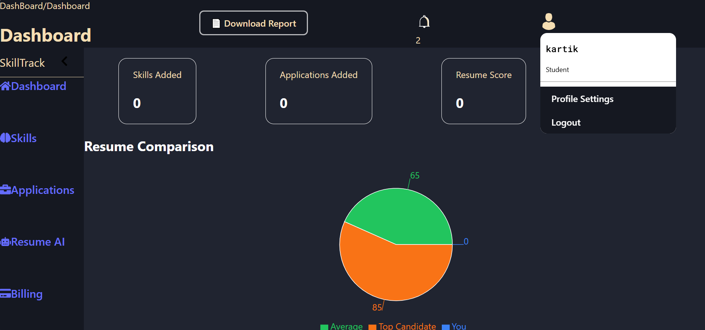
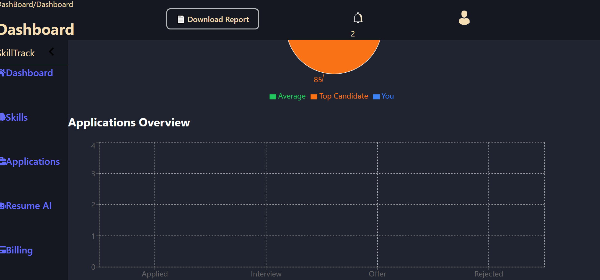

Resume AI Dashboard 🚀

 AI-powered Resume Analyzer & Job Match Platform built with the MERN Stack and OpenAI. 

📸 Preview

  

✨ Features

✅ JWT Authentication
Secure user authentication & protected routes.

✅ AI Resume Analysis
Analyze resumes using OpenAI-powered insights.

✅ JD Matching System
Compare resumes against Job Descriptions with match scoring.

✅ Dashboard Analytics
Track resume performance with interactive analytics.

✅ Resume Score History
Store and revisit previous resume evaluations.

✅ Beautiful Charts & Visualizations
Built using Recharts for clean dashboard metrics.

✅ MongoDB Persistence
Reliable data storage using MongoDB.

🛠 Tech Stack
Category	Technologies
Frontend	React, Tailwind CSS, Recharts
Backend	Node.js, Express.js
Database	MongoDB
Authentication	JWT
AI Integration	OpenAI API

📂 Project Structure
Resume-AI-Dashboard/
│
├── frontend/          # React Frontend
├── backend/           # Express Backend
├── assets/            # Screenshots / GIFs
└── README.md

🚀 Getting Started
1️⃣ Clone Repository
git clone https://github.com/your-username/resume-ai-dashboard.git
cd resume-ai-dashboard

⚙️ Backend Setup
cd backend
npm install

Create a .env file inside backend/

MONGO_URI=your_mongo_uri
OPENAI_API_KEY=your_openai_key
JWT_SECRET=your_secret

Start backend server:

npm run dev
💻 Frontend Setup
cd frontend

npm install
npm run dev

📊 Dashboard Features
Resume Match Score
ATS-style Resume Analysis
Historical Score Tracking
Interactive Charts
AI Recommendations

🧠 AI Workflow
Resume Upload
      ↓
OpenAI Analysis
      ↓
JD Matching
      ↓
Score Generation
      ↓
Dashboard Analytics

📸 Screenshots
## Dashboard

🔒 Environment Variables
Variable	Description
MONGO_URI	MongoDB connection string
OPENAI_API_KEY	OpenAI API key
JWT_SECRET	Secret for JWT authentication

🌟 Future Improvements
PDF Resume Export
Multi-Resume Comparison
AI Interview Questions
Role-based Recommendations
Dark/light Mode switching

🤝 Contributing

Contributions are welcome!

Fork the repo
Create your feature branch
Commit your changes
Push to the branch
Open a Pull Request

📜 License
This project is licensed under the MIT License.

 Made with ❤️ using MERN + OpenAI 

